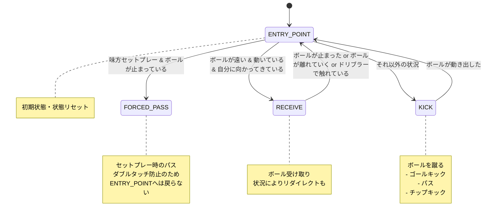

# Attackerスキル（2025年版）

Attacker スキルは、攻撃担当ロボットのための複合スキルです。`PassTargetSelector` が配信するパス先（`game_analysis.pass_target_id`）を取り込みつつ、ボール受け取り／キック／強制パスを状態遷移で切り替えます。

主な特徴（2025年シーズン）:

- `PassTargetSelector` と連携した強制パス／通常パス優先度制御
- 受け取り速度予測用パラメータ (`robot_acc_for_prediction` など) を動的に設定
- `configurePassKick` によるストレート／チップ切り替えの自動化
- オーバードリブル距離の自前モニタリング（0.5m超の自動停止）

## 状態遷移図

Attackerスキルは以下の状態を持ち、状況に応じて適切な状態に遷移します。

## 内部構造

Attackerスキルは以下の内部スキルを保持し、状態に応じて適切なスキルに処理を委譲します：

- `Kick kick_skill` - 標準的なキックを行うスキル
- `GoalKick goal_kick_skill` - ゴールを狙ったキックを行うスキル
- `Receive receive_skill` - ボールを受け取るスキル

## 状態の説明

### ENTRY_POINT

初期化兼リセット。`command->clearSkillStates()` などが走り、内部スキルのビジュアライザもクリアされます。ロボットは一度ボールへ向かう目標を設定し、円形オーバーレイを描いてデバッグに活用します（`visualizer->circle()`）。

### FORCED_PASS

味方セットプレー（自チームDIRECT_FREE / KICKOFF_START）かつボール停止時に遷移。2025年以降は上位層の `game_analysis.pass_target_id` が確定している場合のみ強制パスに入ります。フォールバックとして `pass_target_id` が未指定なら通常ルーチンへ戻ります。受け手が自陣側にいる場合は、チーム全体の前進を優先して敵ゴール方向へキックターゲットを切り替えます。ダブルタッチ防止のため ENTRY_POINT には遷移しません。

状況に応じて通常キックまたはチップキックを使い分けます：

- 近くに敵ロボットがいる場合は、チップキックを使用
- そうでない場合は通常のキックを使用

ダブルタッチを防止するため、この状態から`ENTRY_POINT`に戻る遷移は設けられていません。

### RECEIVE

ボールが遠く（>1.0m）、動いている、そして自ロボットへ向かうときに遷移。`Receive` スキルへ委譲し、以下を実行します。

以下の2つのモードがあります：

1. **リダイレクトモード**: ゴールが見えていて、リダイレクト角度が45度以内の場合、ボールをリダイレクトしてゴールを狙います。
2. **通常受け取りモード**: それ以外の場合は通常のボール受け取りを行います。

以下のいずれかの条件を満たした場合、`ENTRY_POINT`に戻ります：

- ボールが止まった
- ボールが自分から離れていく（おそらく受け取りに失敗した）
- ドリブラーでボールに0.2秒以上触れている（受け取りに成功した）

### KICK

通常時のメイン状態。`PassTargetSelector` がパス先を提供していればそれを最優先し、`configurePassKick()` が自動でストレート／チップを選択します。優先順位は以下の通りです。

1. **GOAL_KICK**: ゴールの角度が広い（5度以上）場合、`goal_kick_skill`を使用してゴールを狙います。
2. **STANDARD_PASS**: 上位層が指定した `pass_target_id` が存在し、自機以外であれば `kick_skill` を使用してパスします。パスコース上に敵がいる場合は `configurePassKick()` がチップキックへ切り替えます。
3. **LOW_CHANCE_GOAL_KICK**: ゴールの角度が狭い（2度以上5度未満）場合、低確率でもゴールを狙います。
4. **MOVE_BALL_TO_OPPONENT_HALF**: 自コートでボールを持っている場合、チップキックを使用して相手コートにボールを移動させます。
5. **FINAL_GUARD**: 上記のいずれにも該当しない場合、最終手段として`goal_kick_skill`を実行します。

ボールが動き出した場合、`ENTRY_POINT`に戻ります。

## 主なパラメータ

- `moving_ball_velocity` : ボールを「移動中」と判断する速度閾値（1.0 m/s）
- `robot_acc_for_prediction` / `robot_max_vel_for_prediction` : Receiveスキルへ伝搬し、ボールインターセプト予測に利用
- `PASS_OBSTACLE_DISTANCE`（内部定数）: パスライン上の敵との距離しきい値
- `ENEMY_NEAR_BALL_DISTANCE` : チップパスへ切り替える敵接近距離

## コンテキスト変数

(注意: `Point` 型は通常 `crane::Vector2d` を指します。詳細は `packages/crane_geometry.md` を参照してください。)

- `kick_target` (Point型) - キックの目標位置
- `forced_pass_receiver_id` (int型) - 強制パスの対象となるロボットのID（pass_target_id経由）
- `pass_receiver_id` (std::optional<uint8_t>型) - 選択されたパス先ロボットのID（自身が選ばれた場合は解除）
- `goal_front_dance_target` (std::optional<Point>型) - ゴール前での動きの目標位置
- `over_dribble` : ドリブル距離監視（0.5m超で強制停止）

## 主要な関数

### printTextOnRobot(std::string s)

ロボットの上部にテキストを表示する補助関数です。デバッグや状態の可視化に使用されます。

### configurePassKick / shouldUseChipKick

`configurePassKick` は目標地点と敵配置を解析し、ストレート／チップ、キックスピードやドリブル有無を自動設定します。`shouldUseChipKick` はパスライン上の敵距離からチップ化を判断します。両者により、攻撃側コードはターゲット座標を渡すだけでパス挙動を決められます。

### OverDribbleInfo

`over_dribble.update()` がドリブル距離を累積し、0.5mを超えると`command->stopHere()`で即停止します。SSLルールのオーバードリブル違反を防止するためのガードです。
