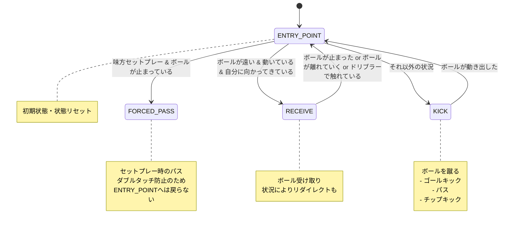

# Attackerスキル

Attackerスキルは、攻撃的な役割を持つロボットのための複合スキルです。ボールを受け取る、キックする、パスするなどの様々な行動を状態遷移に基づいて実行します。

## 状態遷移図

Attackerスキルは以下の状態を持ち、状況に応じて適切な状態に遷移します。

## 内部構造

Attackerスキルは以下の内部スキルを保持し、状態に応じて適切なスキルに処理を委譲します：

- `Kick kick_skill` - 標準的なキックを行うスキル
- `GoalKick goal_kick_skill` - ゴールを狙ったキックを行うスキル
- `Receive receive_skill` - ボールを受け取るスキル

## 状態の説明

### ENTRY_POINT

初期状態であり、状態のリセットにも使われます。この状態では、各内部変数の初期化処理が行われます。ロボットはボールの位置に向かって移動します。`StateMachine`の実装上、この状態の処理関数は実行されず、すぐに他の状態に遷移します。

### FORCED_PASS

味方のセットプレー（直接フリーキックやキックオフ開始時など）で、ボールが止まっている場合に遷移する状態です。パス先のロボットを選択し（`selectPassReceiver`関数を使用）、そのロボットにパスを行います。

状況に応じて通常キックまたはチップキックを使い分けます：

- 近くに敵ロボットがいる場合は、チップキックを使用
- そうでない場合は通常のキックを使用

ダブルタッチを防止するため、この状態から`ENTRY_POINT`に戻る遷移は設けられていません。

### RECEIVE

ボールが遠く（1.0m以上離れている）、動いていて、自分に向かってきている場合に遷移する状態です。この状態では`receive_skill`を使用してボールを受け取ります。

以下の2つのモードがあります：

1. **リダイレクトモード**: ゴールが見えていて、リダイレクト角度が45度以内の場合、ボールをリダイレクトしてゴールを狙います。
2. **通常受け取りモード**: それ以外の場合は通常のボール受け取りを行います。

以下のいずれかの条件を満たした場合、`ENTRY_POINT`に戻ります：

- ボールが止まった
- ボールが自分から離れていく（おそらく受け取りに失敗した）
- ドリブラーでボールに0.2秒以上触れている（受け取りに成功した）

### KICK

`ENTRY_POINT`からの遷移条件に当てはまらない場合、デフォルトでこの状態に遷移します。この状態では状況に応じて以下の行動を取ります：

1. **GOAL_KICK**: ゴールの角度が広い（5度以上）場合、`goal_kick_skill`を使用してゴールを狙います。
2. **STANDARD_PASS**: パス先のロボットが見つかった場合、`kick_skill`を使用してパスします。パスコース上に敵がいる場合はチップキックを使用します。
3. **LOW_CHANCE_GOAL_KICK**: ゴールの角度が狭い（2度以上5度未満）場合、低確率でもゴールを狙います。
4. **MOVE_BALL_TO_OPPONENT_HALF**: 自コートでボールを持っている場合、チップキックを使用して相手コートにボールを移動させます。
5. **FINAL_GUARD**: 上記のいずれにも該当しない場合、最終手段として`goal_kick_skill`を実行します。

ボールが動き出した場合、`ENTRY_POINT`に戻ります。

## パラメータ

- `moving_ball_velocity` - ボールが動いているとみなす速度の閾値（デフォルト: 1.0 m/s）

## コンテキスト変数

(注意: `Point` 型は通常 `crane::Vector2d` を指します。詳細は `docs/crane_basics.md` を参照してください。)

- `kick_target` (Point型) - キックの目標位置
- `forced_pass_receiver_id` (int型) - 強制パスの対象となるロボットのID
- `pass_receiver_id` (std::optional<uint8_t>型) - 選択されたパス先ロボットのID
- `goal_front_dance_target` (std::optional<Point>型) - ゴール前での動きの目標位置

## 主要な関数

### selectPassReceiver()

最適なパス先のロボットを選択する関数です。各味方ロボットに対して以下の要素を考慮してスコアを計算し、最も高いスコアのロボットを選びます：

1. パス先からのゴールの角度 - 角度が広いほどスコアが高い
2. 敵ゴールまでの距離 - 敵ゴールに近いほどスコアが高い
3. パスコース上の敵ロボットの存在 - パスコースに敵がいるとスコアが下がる

### printTextOnRobot(std::string s)

ロボットの上部にテキストを表示する補助関数です。デバッグや状態の可視化に使用されます。
