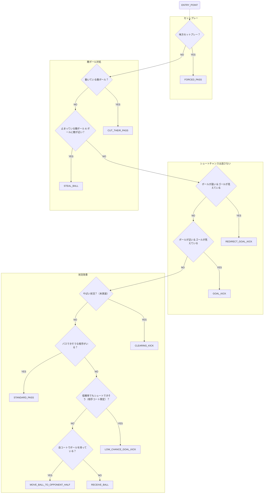

# Attackerスキル

- ENTRY_POINT
- FORCED_PASS
- REDIRECT_GOAL_KICK
- GOAL_KICK
- CLEARING_KICK
- STANDARD_PASS
- LOW_CHANCE_GOAL_KICK
- MOVE_BALL_TO_OPPONENT_HALF
- RECEIVE_BALL

- ENTRY_POINT
- FORCED_PASS
  - 二度と帰ってこなくてOK
- REDIRECT_GOAL_KICK
  - 入：ボールが遠く＆動いている＆自分に向かってきている＆リダイレクト角度
  - 出：ボールが止まった
- GOAL_KICK
  - 入：ボールが近い＆ゴールが見える＆ボールが止まっている
  - 出：ボールが動いた
- STANDARD_PASS
  - 入：ボールが近い＆ボールが停止＆良いパス相手がいる
  - 出：ボールが動いた
- LOW_CHANCE_GOAL_KICK
  - 相手コートで
- MOVE_BALL_TO_OPPONENT_HALF
- RECEIVE_BALL
- FINAL_GUARD

再編成

- ENTRY_POINT
- FORCED_PASS
- RECEIVE
  - RECEIVE
  - REDIRECT_GOAL_KICK
- KICK
  - GOAL_KICK
    - LOW_CHANCE_GOAL_KICK
  - STANDARD_PASS
  - MOVE_BALL_TO_OPPONENT_HALF
- FINAL_GUARD
