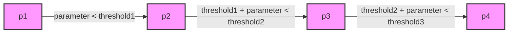

# ディフェンス戦術システム

> **最終更新**: 2024年12月（システム再構築後）
> **関連パッケージ**: [crane_planner_plugins](./packages/crane_planner_plugins.md), [crane_robot_skills](./packages/crane_robot_skills.md)

Craneシステムのディフェンス戦術は、プラグインベースの戦略プランナーとスキルベースのロボット制御により実現されています。

## 主要プランナー

### TotalDefensePlanner

#### 現在のメインプランナー

TotalDefensePlannerは、ゴールキーパーとディフェンダーの配置を決定するプランナーです。このプランナーでは、`calculateRobotCommand`関数を用いてディフェンダーの目標位置を計算し、`getSelectedRobots`関数を用いてゴールキーパーとディフェンダーを選択します。ディフェンダーの目標位置は、`getDefenseLinePoints`関数によって計算されます。

`getDefenseLinePoints`関数は、以下の手順でディフェンダーの配置を決定します。

1. `getDefenseLinePointParameter`関数を使用して、ボールライン上のパラメータを計算します。`DefenseLinePointParameter`は、自陣ペナルティエリアを囲む線をパラメータ化したもので、0から`threshold3`までの値を持ちます。このパラメータは、ディフェンダーが配置されるべきボールライン上の位置を示します。
2. パラメータが存在しない場合、ペナルティエリア内にボールが侵入したときにディフェンダーがいなくなるのを防ぐために、代替のボールラインを使用してパラメータを計算します。
3. パラメータが存在する場合、`getDefenseLinePoint`関数を使用して、パラメータに対応するディフェンダーの目標位置を計算します。
4. 複数のディフェンダーを配置する必要がある場合、`DEFENSE_INTERVAL`パラメータを使用して、ディフェンダー間の間隔を決定します。`DEFENSE_INTERVAL`パラメータのデフォルト値は0.2です。
5. `getDefenseLinePointParameterThresholds`関数を使用して、ディフェンダーが配置されるべき範囲を制限します。

各パラメータの説明は、以下のとおりです。

* `DEFENSE_INTERVAL`: ディフェンダー間の間隔を決定するパラメータです。
* `OFFSET_X`: ペナルティエリアのコーナーを計算する際に使用するX軸方向のオフセットです。
* `OFFSET_Y`: ペナルティエリアのコーナーを計算する際に使用するY軸方向のオフセットです。

`getDefenseLinePointParameter`関数で得られるパラメータは、以下の図に示すように、自陣ペナルティエリアを囲む線をパラメータ化したものです。

この図では、p1, p2, p3, p4はペナルティエリアのコーナーを表し、parameterはp1からp2、p2からp3、p3からp4への距離を示します。

### SecondThreatDefenderPlanner

#### 専用ディフェンダープランナー

SecondThreatDefenderPlannerは、個別のディフェンダーロボットに対する脅威対応を決定するプランナーです。TotalDefensePlannerと組み合わせて使用され、より詳細な守備戦術を実現します。

## Skill

### Goalie

Goalieスキルは、ゴールキーパーの行動を制御するスキルです。このスキルは、ボールの位置、速度、および他のロボットの位置に基づいて、ゴールキーパーの行動を決定します。主なロジックは`inplay`関数にあり、以下の状況に応じて行動を決定します。

* **HALT**: その場に停止
* **THEIR_PENALTY_PREPARATION, THEIR_PENALTY_START**: ボールの排出を停止
* **COMMAND_STOP**: ボールの排出を停止
* **ボール排出**:
  * ボールが止まっていて、味方ペナルティエリア内にある場合、ボールをペナルティエリア外に出します。
  * パスできるロボットのリストを作成し、最も適切なロボットにパスします。
* **シュートブロック**:
  * ボールがゴールに向かっている場合、ボールライン上の最も近い点を計算し、その点に移動してシュートをブロックします。
* **ボールを待ち受ける**:
  * 上記以外の場合、デフォルト位置（自ゴールの中央の0.9倍の位置）に移動し、ボールを待ち受けます。
  * ボールが自コートにある場合、敵のパス先を予測し、その位置に移動してパスカットを試みます。

### Marker

Markerスキルは、指定された敵ロボットをマークするスキルです。このスキルは、`update`関数にあり、`mark_mode`パラメータに基づいて、以下のモードでマーキングを行います。

* **save_goal**:
  * 敵ロボットと自ゴールの中間の位置に移動します。
  * 敵ロボットがシュートするのを防ぐことを目的とします。
* **intercept_pass**:
  * 敵ロボットとボールの中間の位置に移動します。
  * 敵ロボットへのパスを阻止することを目的とします。

## JapanOpen2025での実績

### 効果的だった防御戦術

**TotalDefenseFormation**:

* ボールライン防御による効果的なシュートブロック
* 動的なディフェンダー配置による空間制御
* ゴールキーパーとの連携による組織的防御

**RVO2衝突回避システム**:

* 密集状況でのロボット同士の衝突回避
* 防御時の安全な位置取り
* ルール違反（BOT_CRASH）の大幅削減

### 防御性能の向上

**crane_physicsとの統合**:

* ボール軌道予測による先回り防御
* 移動時間計算による最適ポジショニング
* パス解析による効果的なパスカット

**crane_local_plannerとの連携**:

* 防御陣形維持のための経路計画
* ディフェンスエリア回避機能
* 動的速度制限による安定制御

## 技術的特徴

### プラグインアーキテクチャ統合

* **crane_planner_plugins**: TotalDefenseFormationの戦略実装
* **crane_robot_skills**: Goalieスキル、Markerスキルの個別制御
* **crane_session_controller**: 試合状況に応じた防御戦術選択

### 今後の発展方向

* 機械学習による相手攻撃パターン学習
* より高度な予測防御システム
* 攻守転換時の素早い陣形変更

---

**詳細な実装**: [crane_planner_plugins](./packages/crane_planner_plugins.md)の防御戦術と[crane_robot_skills](./packages/crane_robot_skills.md)の防御スキルを参照
