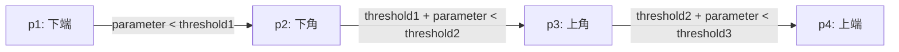

# ディフェンス戦術システム

> **最終更新**: 2026年1月
> **関連パッケージ**: [crane_planner_plugins](./packages/crane_planner_plugins.md), [crane_robot_skills](./packages/crane_robot_skills.md)

Craneシステムのディフェンス戦術は、プラグインベースの戦略Tacticとスキルベースのロボット制御により実現されています。

## 主要プランナー (Tactic)

### TotalDefenseTactic

#### 現在のメイン守備戦略

`TotalDefenseTactic`は、ゴールキーパーとディフェンダーの配置を決定する統合守備戦略です。

- **ロボット選択**: ゴールキーパー1台と、状況に応じた数のディフェンダーを選択します。
- **配置計算**: `getDefenseLinePoints` 関数を用いて、自陣ペナルティエリアを囲む「守備ライン」上の最適な待ち受け位置を計算します。
- **動的調整**: ボールの位置や速度に応じて、ディフェンダー間の間隔（`DEFENSE_INTERVAL`）やラインのオフセットを調整します。

守備ラインのパラメータ化イメージ:

### SecondThreatDefenderTactic

個別ロボットに対して、最も脅威となる敵ロボット（セカンドスレット）へのマークやインターセプトを指示する戦略です。

## スキル (Skill)

### Goalie

ゴールキーパー専用の行動ロジックです。

- **シュートブロック**: ボールの軌道予測（`crane_physics`）に基づき、ゴールライン上の交点へ素早く移動します。
- **ボール排出**: 自陣ペナルティエリア内にボールが止まった場合、安全な味方へのパスまたはクリアを実行します。
- **パスカット**: 敵のパス先を予測し、インターセプト可能な位置へ移動します。

### Marker

指定された敵ロボットをマークするスキルです。

- **save_goal**: 敵ロボットと自ゴールを結ぶ線上でブロックします。
- **intercept_pass**: 敵ロボットへのパスコースを遮断します。

## 技術的特徴

### 物理モデルとの統合

- **crane_physics**: ボール軌道予測による先回り防御、敵ロボットの移動時間予測。
- **crane_geometry**: ペナルティエリア境界やシュートコース（角度範囲）の精密な計算。

### 回避・安全制御

- **RVO2衝突回避**: 密集した守備陣形内での自チームロボット同士の衝突を回避。
- **エリア回避**: `crane_local_planner` と連携し、ディフェンダーが誤って自陣ペナルティエリア内に侵入してファウルになるのを防止。

---

**詳細な実装**: [crane_planner_plugins](./packages/crane_planner_plugins.md) と [crane_robot_skills](./packages/crane_robot_skills.md) を参照
