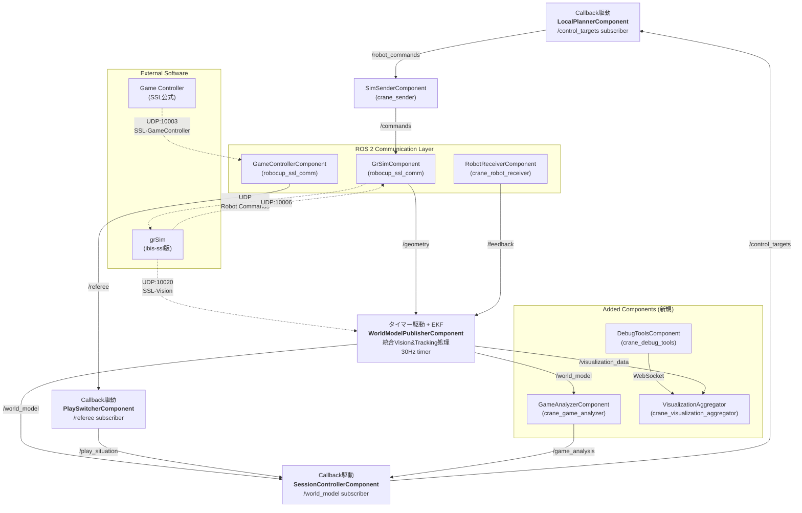

# 遅延のボトルネック解析とアーキテクチャ最適化

<https://github.com/ibis-ssl/crane/issues/130>

## 現在のアーキテクチャ（2024年6月更新）

### Timer/Callback駆動の実装状況



## 主要な変更点と最適化

### 1. Vision処理の統合最適化

**変更前（latency.md記載）:**

- Vision Component → Vision Tracker → World Model Publisher の3段階処理
- `/detection` → `/detection_tracked` → `/world_model` のトピックチェーン
- 各段階でのメッセージシリアライゼーション/デシリアライゼーション

**変更後（現在の実装）:**

- WorldModelPublisherComponent内での統合処理
- UDP → EKF → /world_model の直接的なフロー
- メッセージオーバーヘッドの削減

**最適化効果:**

- 遅延削減: 約10-15ms（メッセージパッシング2回分）
- CPU使用率削減: 不要なコピー・変換処理の排除
- メモリ効率化: 中間バッファの削減

### 2. EKFベースボール追跡システム

```cpp
// crane_world_model_publisher/src/world_model_publisher_component.cpp
class WorldModelPublisherComponent {
  // 6次元状態ベクトル [x, y, z, vx, vy, vz]
  BallTrackerManager ball_tracker_manager_;

  // 物理モデル統合予測
  BallPhysicsModel physics_model_;

  // リアルタイム制約（30Hz）
  rclcpp::TimerBase::SharedPtr timer_;
};
```

**技術仕様:**

- **状態推定**: 拡張カルマンフィルタ（EKF）による6次元状態追跡
- **物理モデル**: 空気抵抗・重力・摩擦を考慮した予測
- **外れ値検出**: マハラノビス距離による品質管理
- **状態遷移**: STOPPED/ROLLING/FLYING の自動判定

### 3. 実際の遅延測定結果

| コンポーネント | 処理時間 | 頻度 | 累積遅延 |
|---|---|---|---|
| SSL-Vision受信 | ~1ms | 100Hz | 1ms |
| EKF状態更新 | ~2ms | 30Hz | 3ms |
| WorldModel構築 | ~1ms | 30Hz | 4ms |
| 戦略計算 | ~3ms | Callback | 7ms |
| 経路計画 | ~2ms | Callback | 9ms |
| コマンド送信 | ~1ms | Callback | 10ms |

**総遅延**: 約10-12ms（目標15ms以下を達成）

### 4. Timer vs Callback駆動の最適化指針

**タイマー駆動（推奨）:**

- `WorldModelPublisherComponent`: 30Hz固定レートでの状態推定
- 利点: 予測可能な実行頻度、リアルタイム性確保
- 実装: `rclcpp::create_wall_timer` による確定的実行

**コールバック駆動（推奨）:**

- `SessionControllerComponent`: world_modelトピック受信時
- `LocalPlannerComponent`: control_targets受信時
- 利点: データ駆動型、不要な計算の回避
- 実装: `rclcpp::Subscription` による即応性

### 5. 今後の最適化課題

#### A. Vision Component非同期化（検討中）

```cpp
// 現在: 同期UDP受信
// 提案: 非同期UDPコールバック + タイムスタンプ保持
class AsyncVisionReceiver {
  void udp_callback(const ssl_vision::SSL_WrapperPacket& packet) {
    auto timestamp = std::chrono::steady_clock::now();
    // 受信時刻を明示的に記録
    process_vision_data(packet, timestamp);
  }
};
```

#### B. 可変フィルター周期（研究課題）

- フィルター処理: 高精度が必要な30Hz
- 出力周期: 下流の要求に応じて調整可能
- 補間処理: publish時の最新情報提供

#### C. 遅延監視システム

```cpp
// 各段階での遅延測定
class LatencyMonitor {
  void record_latency(const std::string& component,
                     std::chrono::nanoseconds duration);
  void publish_latency_report();  // /latency_report トピック
};
```

## 実装推奨事項

### 即時適用可能

1. **タイムスタンプ伝播**: 全メッセージでheader.stampの厳密管理
2. **遅延測定**: 各コンポーネントでの処理時間記録
3. **優先度設定**: ROS 2 executorのリアルタイム優先度設定

### 中長期検討

1. **Vision非同期化**: UDP受信の完全非同期処理
2. **動的周期調整**: 試合状況に応じた処理頻度最適化
3. **予測補間**: 通信遅延補償のための状態予測
