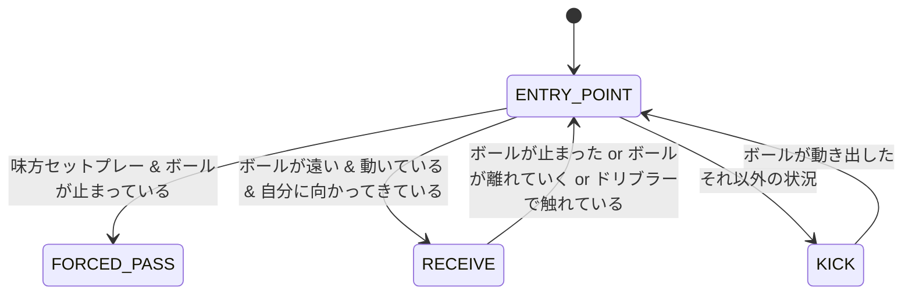

# オフェンス戦術システム

> **最終更新**: 2024年12月（システム再構築後）
> **関連パッケージ**: [crane_robot_skills](./packages/crane_robot_skills.md), [crane_tactics](./packages/crane_tactics.md)

Craneシステムにおけるオフェンス戦術は、`crane_robot_skills`パッケージのスキルベースアーキテクチャと`crane_tactics`の戦略プランナーにより実現されています。

## アーキテクチャ概要

### スキルベース設計

オフェンス行動は、個別のロボットスキルの組み合わせとして実装されます：

- **Attackerスキル**: 複合的な攻撃行動（状態遷移ベース）
- **Kickスキル**: ボールキック動作（ストレート・チップ対応）
- **Passスキル**: パス実行とパス受信
- **Receiveスキル**: ボール受け取り専用スキル
- **Dribbleスキル**: ドリブル動作（距離制限付き）

### 状態遷移システム

各スキルは状態機械として実装され、ゲーム状況に応じて適切な行動を選択します。

## 主要オフェンススキル

### Attackerスキル（複合攻撃行動）

**実装状況**: crane_robot_skills/skills/attacker.hpp

**機能**:

- ボール状況に応じた自動行動選択
- ダブルタッチ防止機能（セットプレー時）
- 相手ロボット回避
- 最適なキックタイミング判定

### Passスキル（パス実行）

**実装状況**: crane_robot_skills/skills/pass.hpp

**機能**:

- **パス先選択**: 敵ロボットの位置を考慮した最適パス先計算
- **パス力調整**: 距離に応じた適切なキック力設定
- **チップパス判定**: 障害物回避のための自動チップキック選択
- **成功率予測**: crane_physicsのパス解析による成功率計算

### Receiveスキル（ボール受け取り）

**実装状況**: crane_robot_skills/skills/receive.hpp

**機能**:

- **軌道予測**: crane_physicsのボール物理モデルによる到達点予測
- **受け取り位置最適化**: ボール軌道に基づく最適受け取り位置計算
- **次アクション準備**: 受け取り後の即座な次行動への遷移

### Kickスキル（キック動作）

**実装状況**: crane_robot_skills/skills/kick.hpp

**機能**:

- **ストレートキック**: 地面を転がるキック（最大6.0m/s制限）
- **チップキック**: 空中を飛ぶキック（障害物回避用）
- **キック力制限**: ルール遵守のための自動力制限
- **方向精度**: 高精度な方向制御

### Dribbleスキル（ドリブル動作）

**実装状況**: crane_robot_skills/skills/dribble.hpp

**機能**:

- **距離制限**: SSL規則準拠の1m未満制限
- **ボール制御**: ドリブラーによる精密なボール制御
- **経路計画**: crane_local_plannerとの連携による安全な経路

## 戦略レベルの統合

### crane_tacticsとの連携

**AttackFormation**:

- 複数ロボットでの連携攻撃
- パス回しによるスペース創出
- 相手ディフェンス崩し

**OffenseFormation**:

- 攻撃時のロボット配置最適化
- ボール保持者のサポート
- 攻撃継続のためのポジショニング

## 実装の詳細

各スキルの実装詳細は以下のドキュメントを参照してください：

- **[crane_robot_skills](./packages/crane_robot_skills.md)** - 個別スキルの実装仕様
- **[crane_tactics](./packages/crane_tactics.md)** - 戦略プランナーの統合実装
- **[attacker.md](./attacker.md)** - Attackerスキルの詳細な状態遷移
