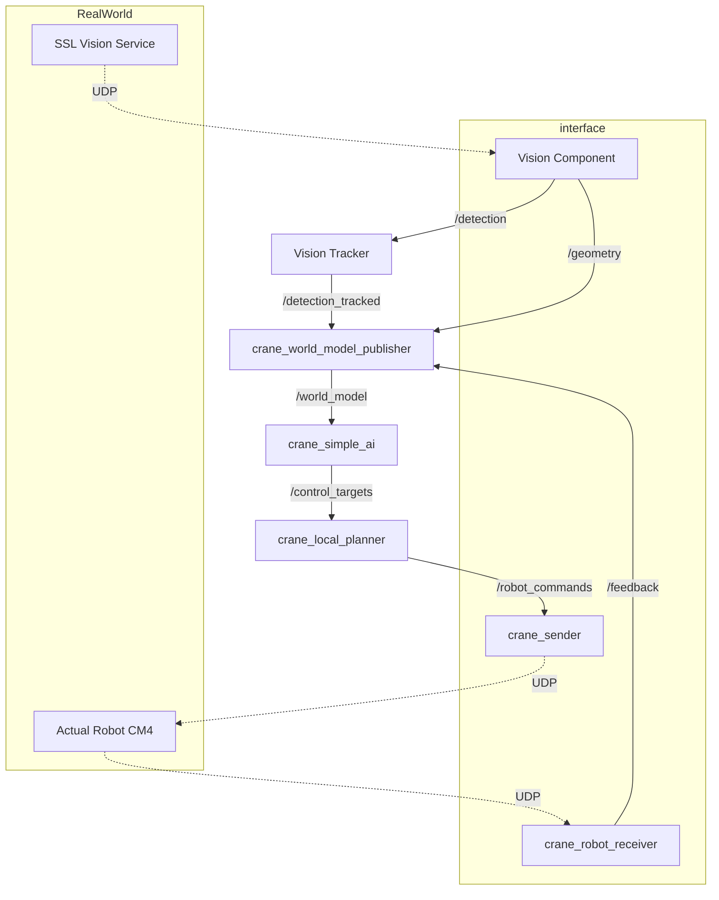

# Simple AI

## 立ち上げ

```bash
ros2 launch crane_bringup crane.launch.py simple_ai:=true sim:=false
```

## GUI使い方

- ロボットの設定
  - IDを指定
- コマンドの追加
  - プルダウンでコマンドの種類を選ぶ
  - 引数を設定する
  - 追加ボタンを押す
- コマンドキューの編集
  - コマンドキューの中身を選択する
  - 編集できる
  - 実行中は編集できなくなる
- コマンドキューの実行
  - 実行ボタンを押す
    - 実行中は停止ボタンになる
  - コマンドは上から順に実行される

## ノードダイアグラム


